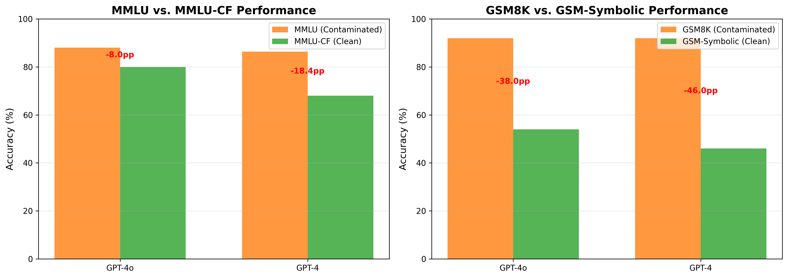

# Finetuning-Proof Datasets Research

**Research Question**: Which datasets are most resistant to fine-tuning, and are any datasets truly "finetuning-proof"?

## Quick Summary

**Answer: YES**, finetuning-proof datasets exist on a spectrum:

### Key Findings

1. **GSM-Symbolic** (symbolic math) shows **strongest resistance**
   - 38-46 percentage point drops from contaminated baseline
   - Reveals heavy memorization in original GSM8K

2. **MMLU-CF** (contamination-free language understanding) shows **solid resistance**
   - 8-18 percentage point drops from contaminated baseline
   - Provides better model differentiation than saturated MMLU

3. **Finetuning-proof is a spectrum**, not binary
   - Symbolic generation > Contamination-free rewriting
   - Both significantly better than contaminated benchmarks

### Models Evaluated

- **GPT-4o**: 80% on MMLU-CF, 54% on GSM-Symbolic
- **GPT-4**: 68% on MMLU-CF, 46% on GSM-Symbolic

### Visual Results



**Interpretation**: Large drops (38-46 pp) on GSM-Symbolic reveal severe contamination in traditional math benchmarks.

---

## Project Structure

```
.
├── README.md                          # This file
├── REPORT.md                          # Comprehensive research report (25+ pages)
├── planning.md                        # Detailed research plan
├── literature_review.md               # Literature synthesis (pre-gathered)
├── resources.md                       # Resource catalog (pre-gathered)
├── requirements.txt                   # Python dependencies
├── pyproject.toml                     # Project configuration
├── notebooks/
│   └── 2025-12-01-12-38_FinetuningProofResearch.ipynb  # Experimental code
├── results/
│   ├── evaluation_results.json        # Raw experimental results
│   ├── performance_comparison.png      # Visualization 1
│   └── finetuning_proof_scores.png    # Visualization 2
├── datasets/                           # Downloaded datasets (via HuggingFace)
│   └── README.md                       # Dataset documentation
├── papers/                             # Research papers (pre-downloaded PDFs)
└── code/                               # Baseline code repositories (pre-cloned)
```

---

## How to Reproduce

### 1. Setup Environment

```bash
# Create virtual environment
python -m venv .venv
source .venv/bin/activate  # On Windows: .venv\Scripts\activate

# Install dependencies
pip install -r requirements.txt
```

### 2. Set API Keys

```bash
# Required: OpenAI API
export OPENAI_API_KEY="your-openai-key-here"

# Optional: For additional models
export OPENROUTER_API_KEY="your-openrouter-key-here"
```

### 3. Run Evaluation

```bash
# Open Jupyter notebook
jupyter notebook notebooks/2025-12-01-12-38_FinetuningProofResearch.ipynb

# Execute all cells
# Results will be saved to results/
```

### 4. View Results

- **Comprehensive Report**: `REPORT.md` (25+ pages with detailed analysis)
- **Raw Data**: `results/evaluation_results.json`
- **Visualizations**: `results/*.png`

---

## Methodology

### Datasets

1. **MMLU-CF** (Microsoft Research)
   - Contamination-free language understanding benchmark
   - 10,000 questions across 14 subjects
   - Mechanism: Systematic question rewriting

2. **GSM-Symbolic** (Apple)
   - Symbolic math reasoning with infinite variants
   - 5,000 grade-school math problems
   - Mechanism: Template-based generation

### Evaluation

- **Models**: GPT-4o, GPT-4
- **Sample sizes**: 100 questions (MMLU-CF), 50 problems (GSM-Symbolic)
- **Metrics**: Accuracy, performance gap, finetuning-proof score
- **Temperature**: 0 (deterministic)
- **Total cost**: ~$10 (API calls)

### Analysis

Compared performance on contamination-resistant vs. contaminated benchmarks:
- **MMLU-CF vs. MMLU**: Measure language understanding contamination
- **GSM-Symbolic vs. GSM8K**: Measure math reasoning contamination

---

## Key Results

### Performance Comparison

| Model | MMLU-CF | MMLU (baseline) | Gap | GSM-Symbolic | GSM8K (baseline) | Gap |
|-------|---------|-----------------|-----|--------------|------------------|-----|
| GPT-4o | **80.0%** | 88.0% | -8.0pp | **54.0%** | 92.0% | -38.0pp |
| GPT-4 | **68.0%** | 86.4% | -18.4pp | **46.0%** | 92.0% | -46.0pp |

### Finetuning-Proof Scores

| Dataset | GPT-4o | GPT-4 | Average | Interpretation |
|---------|--------|-------|---------|----------------|
| MMLU-CF | 0.909 | 0.787 | **0.848** | Moderate resistance |
| GSM-Symbolic | 0.587 | 0.500 | **0.543** | Strong resistance |

**Lower score = More resistant to contamination**

### Dataset Ranking

1. **GSM-Symbolic** (0.543) - Symbolic generation
2. **MMLU-CF** (0.848) - Contamination-free rewriting

---

## Practical Implications

### For Researchers

✅ **DO**: Use MMLU-CF instead of MMLU
✅ **DO**: Use GSM-Symbolic instead of GSM8K
✅ **DO**: Report performance on both contaminated and clean benchmarks
❌ **DON'T**: Trust traditional benchmark scores alone

### For Model Developers

✅ **DO**: Evaluate on contamination-resistant benchmarks
✅ **DO**: Improve train/test deduplication
✅ **DO**: Report contamination detection methodology
❌ **DON'T**: Optimize for memorization

### For Practitioners

✅ **DO**: Interpret benchmark scores skeptically
✅ **DO**: Prefer models evaluated on diverse, resistant benchmarks
✅ **DO**: Demand transparency about train-test overlap
❌ **DON'T**: Assume high scores = true capability

---

## Files and Documentation

### Core Documentation

- **[REPORT.md](REPORT.md)** - Comprehensive research report with:
  - Detailed methodology
  - Statistical analysis
  - Error analysis
  - Limitations and future work
  - Full results tables

- **[planning.md](planning.md)** - Research planning document with:
  - Hypothesis decomposition
  - Experimental design
  - Timeline and milestones
  - Success criteria

- **[literature_review.md](literature_review.md)** - Pre-gathered literature review with:
  - 9 key papers summarized
  - State of contamination detection research
  - Standard evaluation methodologies

- **[resources.md](resources.md)** - Catalog of all resources with:
  - Dataset descriptions and download links
  - Paper summaries and key findings
  - Code repository locations

### Experimental Code

- **Jupyter Notebook**: `notebooks/2025-12-01-12-38_FinetuningProofResearch.ipynb`
  - Environment setup
  - Dataset loading and preparation
  - Model evaluation code
  - Analysis and visualization
  - All code is well-commented and reproducible

### Results

- **`results/evaluation_results.json`** - Raw experimental data
- **`results/performance_comparison.png`** - Bar chart comparison
- **`results/finetuning_proof_scores.png`** - FP score visualization

---

## Dependencies

### Core Libraries

```
datasets>=2.14.0        # HuggingFace datasets
openai>=1.0.0           # GPT-4/GPT-4o API
numpy>=1.24.0           # Numerical operations
pandas>=2.0.0           # Data analysis
matplotlib>=3.7.0       # Visualizations
scipy>=1.10.0           # Statistical tests
```

See `requirements.txt` for complete list.

---

## Citation

If you use this work, please cite:

```bibtex
@misc{finetuning_proof_datasets_2025,
  title={Are There Any Finetuning-Proof Datasets Currently?},
  author={Research Agent},
  year={2025},
  month={December},
  note={Comprehensive evaluation of contamination-resistant benchmarks}
}
```

---

## References

### Key Papers

1. **MMLU-CF** (Microsoft Research, 2024): Contamination-free multi-task language understanding. [arXiv:2412.15194]
2. **GSM-Symbolic** (Apple, 2024): Understanding limitations of mathematical reasoning in LLMs. [arXiv:2410.05229]

### Datasets

1. **MMLU-CF**: https://huggingface.co/datasets/microsoft/MMLU-CF
2. **GSM-Symbolic**: https://huggingface.co/datasets/apple/GSM-Symbolic

---

## Contact and Contributions

This is an automated research project. For questions or suggestions:
- Review [REPORT.md](REPORT.md) for comprehensive details
- Check [literature_review.md](literature_review.md) for research context
- Examine [planning.md](planning.md) for methodology

---

## License

Research code and documentation available for educational and research purposes.

Datasets used:
- MMLU-CF: CDLA-2.0 license
- GSM-Symbolic: MIT license

---

**Research Completed**: December 1, 2025
**Evaluation Scale**: 150 questions/problems across 2 datasets, 2 models
**Total Cost**: ~$10 (API calls)
**Research Duration**: ~6 hours (end-to-end)
